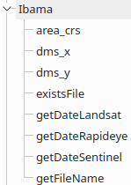

# Ibama Expressions Plugin  

***Ibama Expressions*** add new functions in expression.  

## Expressions: ##  
 

* area_crs: Calculate area using a CRS(Coordinate Reference System).
  * Input: Definition of CRS ID.  
  Ex(s).: 'EPSG:5671' or 'USER:100019'.  
  \* The CRS need be projected.
  * Output: Area with unit of CRS.
  * Example: area_crs('EPSG:5671') -> 223220950780.08203

* dms_x: Get a longitude with Degree Minute and Seconds.
  * Input: Definition of CRS ID.  
  Ex.: 'EPSG:4326'.  
  \* The CRS need be geographic.
  * Output: A longitude with Degree Minute and Seconds.
  * Example: dms_x('EPSG:4326') -> '50° 57' 42.87" W'

* dms_y: Get a latitude with Degree Minute and Seconds
  * Input: Definition of CRS ID.  
  Ex.: 'EPSG:4326'.  
  \* The CRS need be geographic.
  * Output: A latitude with Degree Minute and Seconds.
  * Example: dms_y('EPSG:4326') -> '08° 44' 16.97" S'

* existFile: Return a boolean, where, ***true*** exists and ***false*** otherwise.
  * Input: Pathfile  
  Ex.: '/home/lmotta/data/tif/224_066_08082009.tif'  
  * Output: true or false
  * Example:  
  existsFile( '/home/lmotta/data/tif/224_066_08082009.tif'  ) -> true

* getDateLandsat: Return a date.
  * Input: Name of image(landsat format).  
  Ex.: 'LC81390452014295LGN00.tif'  
  * Output: The date of name.
  * Example:  
  getDateLandsat('LC81390452014295LGN00.tif') -> <date: 2014-10-22>

* getDateRapideye: Return a date.
  * Input: Name of image(rapideye format).  
  Ex.: '2227625_2012-12-26T142009_RE1_3A-NAC_14473192_171826.tif'
  * Output: The date of name.
  * Example:  
  getDateRapideye('2227625_2012-12-26T142009_RE1_3A-NAC_14473192_171826.tif') -> <date: 2012-12-26>
  
* getDateSentinel: Return a date.
  * Input: Name of image(sentinel format).  
  Ex.: 's1a-ew-grd-hh-20141031t223708-20141031t223811-003079-003869-001.tif'
  * Output: The date of name.
  * Example:  
  getDateSentinel('s1a-ew-grd-hh-20141031t223708-20141031t223811-003079-003869-001.tif') -> <date: 2014-10-31>

* getFileName: Return the name of file(without extension).
  * Input: Pathfile.  
  Ex.: '/home/user/readme.txt'
  * Output: Name of file.
  * Example:  
  getFileName('/home/user/readme.txt') -> 'readme'
