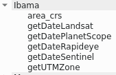

# Ibama Expressions Plugin  

***Ibama Expressions*** add new functions in expression.  

## Expressions: ##  
 

* area_crs: Calculate area using a CRS(Coordinate Reference System).
  * Input: Definition of CRS ID.  
  Ex(s).: 'EPSG:5671' or 'USER:100019'.  
  \* The CRS need be projected.
  * Output: Area with unit of CRS.
  * Example: area_crs('EPSG:5671') -> 223220950780.08203

* getDateLandsat: Return a date.
  * Input: Name of image(landsat format).  
  Ex.: 'LC81390452014295LGN00.tif'  
  * Output: The date of name.
  * Example:  
  getDateLandsat('LC81390452014295LGN00.tif') -> <date: 2014-10-22>

* getDatePlanetScope: Return a date.
  * Input: Name of image(planet scope format).  
  Ex.: 'PSScene4Band_20190310_131656_0f4a.tif'  
  * Output: The date of name.
  * Example:  
  getDateLandsat('PSScene4Band_20190310_131656_0f4a.tif') -> <date: 2019-03-10>

* getDateRapideye: Return a date.
  * Input: Name of image(rapideye format).  
  Ex.: '2227625_2012-12-26T142009_RE1_3A-NAC_14473192_171826.tif'
  * Output: The date of name.
  * Example:  
  getDateRapideye('2227625_2012-12-26T142009_RE1_3A-NAC_14473192_171826.tif') -> <date: 2012-12-26>
  
* getDateSentinel: Return a date.
  * Input: Name of image(sentinel format).  
  Ex.: 's1a-ew-grd-hh-20141031t223708-20141031t223811-003079-003869-001.tif'
  * Output: The date of name.
  * Example:  
  getDateSentinel('s1a-ew-grd-hh-20141031t223708-20141031t223811-003079-003869-001.tif') -> <date: 2014-10-31>

* getUTMZone: Return the UTM Zone.
Number(Longitude zone) and character(Latitude zone).  
\* [UTM Grid Zones of the World](http://www.dmap.co.uk/utmworld.htm)
  * Input: None.
  * Output: UTM Zone.
  * Example:  
  getUTMzone() -> '20M'
